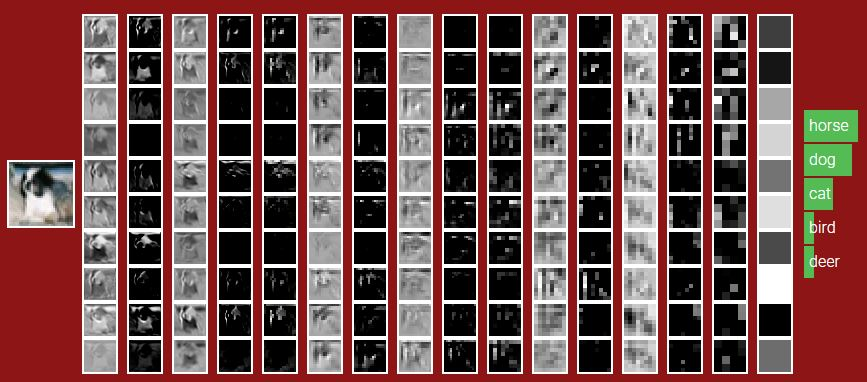

# Stanford cs231n CNN for Visual Recognition

     

## Course Description
Computer Vision has become ubiquitous in our society, with applications in search, image understanding, apps, mapping, medicine, drones, and self-driving cars. Core to many of these applications are visual recognition tasks such as image classification, localization and detection. Recent developments in neural network (aka “deep learning”) approaches have greatly advanced the performance of these state-of-the-art visual recognition systems. This course is a deep dive into details of the deep learning architectures with a focus on learning end-to-end models for these tasks, particularly image classification. During the 10-week course, I've learned to implement, train and debug their own neural networks and gain a detailed understanding of cutting-edge research in computer vision. The final assignment involves training a multi-million parameter convolutional neural network and applying it on the largest image classification dataset (ImageNet). Throughout the course, I learned how to set up the problem of image recognition, the learning algorithms (e.g. backpropagation), practical engineering tricks for training and fine-tuning the networks. Much of the background and materials of this course is drawn from the ImageNet Challenge.

## Assignments
For assignment 2 and 3, I used PyTorch as I am more familiar with it.
### Assignment 1:
- Q1: k-Nearest Neighbor classifier
- Q2: Training a Support Vector Machine
- Q3: Implement a Softmax classifier
- Q4: Two-Layer Neural Network
- Q5: Higher Level Representations: Image Features

### Assignment 2:
- Q1: Fully-connected Neural Network
- Q2: Batch Normalization
- Q3: Dropout
- Q4: Convolutional Networks
- Q5: PyTorch / TensorFlow on CIFAR-10

### Assignment 3:
- Q1: Image Captioning with Vanilla RNNs
- Q2: Image Captioning with LSTMs
- Q3: Network Visualization: Saliency maps, Class Visualization, and Fooling Images
- Q4: Style Transfer
- Q5: Generative Adversarial Networks